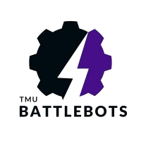

# TMU BattleBots

<p align="center">
  
</p>

<p align="center">
  The official website for Toronto Metropolitan University's BattleBots team - showcasing our robot designs, competition achievements, and technical resources.
</p>

<p align="center">
  <a href="#about">About</a> •
  <a href="#features">Features</a> •
  <a href="#project-structure">Project Structure</a> •
  <a href="#installation">Installation</a> •
  <a href="#usage">Usage</a> •
  <a href="#robot-arsenal">Robot Arsenal</a> •
  <a href="#tools-and-calculators">Tools and Calculators</a> •
  <a href="#ml-and-ai-examples">ML and AI Examples</a> •
  <a href="#contributing">Contributing</a> •
  <a href="#license">License</a>
</p>

## About

TMU BattleBots is a student-run club based at Toronto Metropolitan University (formerly Ryerson University) focused on designing, building, and competing with combat robots across multiple weight classes. Our team brings together students passionate about engineering, robotics, and competitive design.

This repository contains the code for the TMU BattleBots website, which serves as our team's online presence and resource hub for members and the broader combat robotics community.

## Features

- 📱 **Responsive Design**: Fully responsive website that works on mobile, tablet, and desktop devices
- 🤖 **Robot Gallery**: Showcases our combat robots with detailed specifications
- 🧮 **Combat Robot Calculators**: Tools for calculating motor specs, weapon energy, and other critical parameters
- 🏆 **Competition Information**: Details about our tournament participation and achievements
- 🎮 **Interactive Game**: Link to our BattleBots simulation game
- 📊 **Machine Learning Examples**: Sample ML code for robotics applications

## Project Structure

```
TMU-Battlebots-main/
├── images/                  # Image assets for the website
│   ├── battlebots.jpeg      # Team photo
│   ├── gallery-1.png        # Gallery image
│   ├── logo.png             # Team logo
│   └── placeholder.png      # Placeholder image for bots
│
├── ML/                      # Machine learning examples
│   └── NeuralNetworkExample.py  # Sample neural network implementation
│
├── speccalculator/          # Advanced calculator for bot specs
│   └── index.html           # Standalone calculator application
│
├── Website(WIP)/            # Work-in-progress website files
│   ├── index.html           # WIP homepage
│   ├── style.css            # WIP styles
│   └── teamlogo.png         # Team logo
│
├── index.html               # Main website homepage
├── script.js                # JavaScript functionality
├── styles.css               # CSS styling
└── README.md                # This documentation file
```

## Usage

The website is organized into several sections:

- **About Us**: Information about our team and mission
- **Gallery**: Photos of our robots and team activities
- **Robot Arsenal**: Catalog of our combat robots with specifications
- **Calculator**: Tools for designing and optimizing combat robots
- **Game**: Link to our interactive BattleBots simulation game
- **GitHub**: Link to our GitHub organization for CAD files and code

## Robot Arsenal

Our team develops robots in several weight classes:

- **1lb**: Mighty Mouse, Victorious Monty, Lebot James
- **3lb**: Pancake Flipper, Chop Chop, Terminated
- **30lb**: Richard

Each robot features unique weapons and strategies:
- Vertical spinners
- Horizontal spinners
- Pneumatic flippers
- Overhead axes
- Overhead hammers
- Hydraulic crushers

## Tools and Calculators

The website includes two calculator tools:

1. **Basic Calculator**: Integrated into the main website, this tool calculates:
   - Motor RPM based on KV rating and voltage
   - Weapon energy and tip speed
   - Spinup time estimates
   - Recommended components based on weight class

2. **Advanced Simulator**: A more comprehensive tool with:
   - Interactive visual design interface
   - Armor impact resistance calculations
   - Drive system simulations

## ML and AI Examples

We've included a basic neural network example in the ML directory to demonstrate how machine learning can be applied to combat robotics. This example shows:

- Simple neural network implementation
- Training with sample data
- Making predictions based on learned patterns

Future implementations will include:
- Weapon optimization algorithms
- Drive system control improvements
- Self-balancing systems
